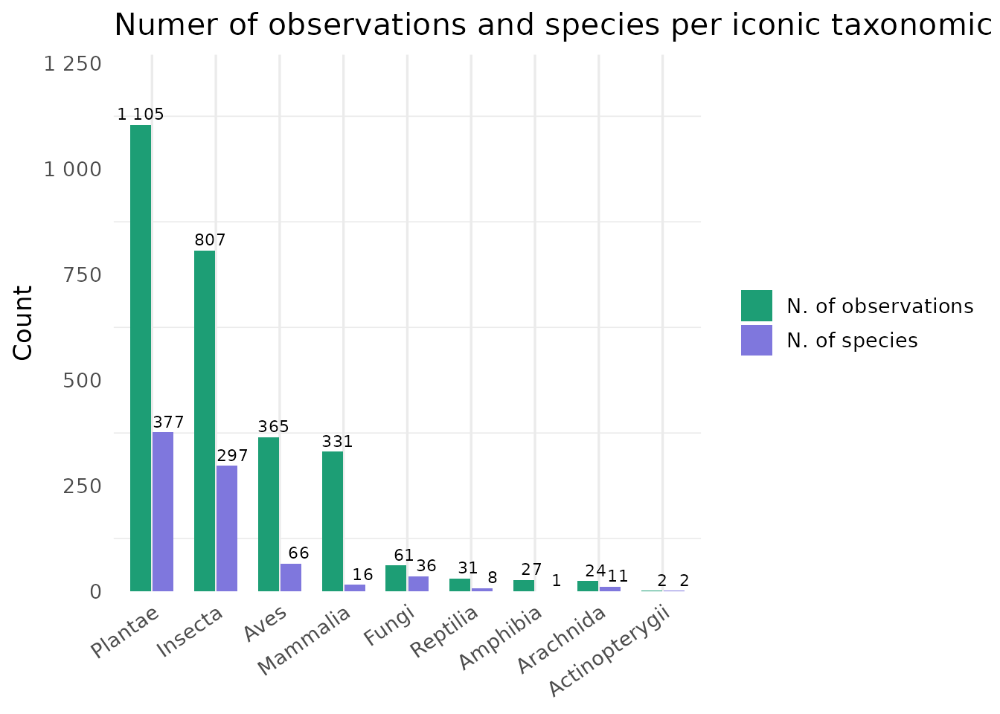
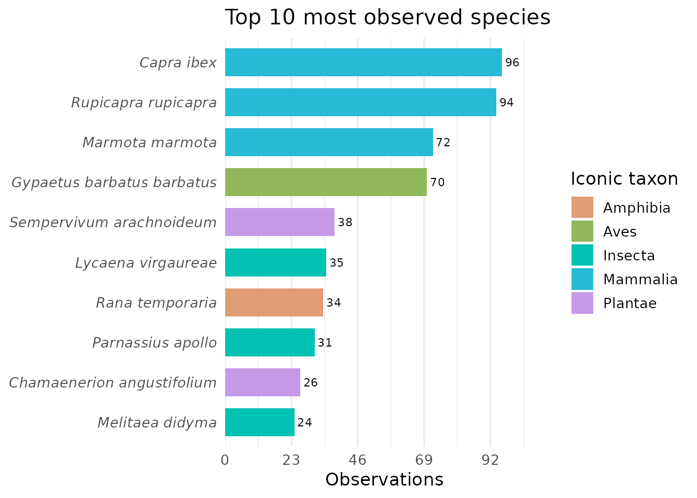
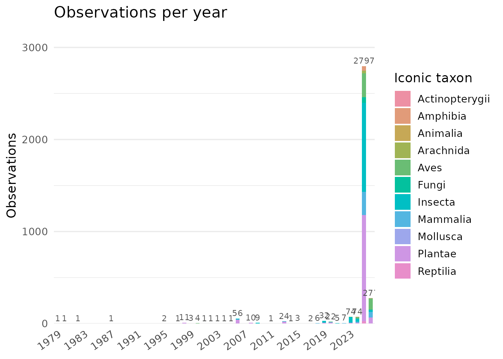
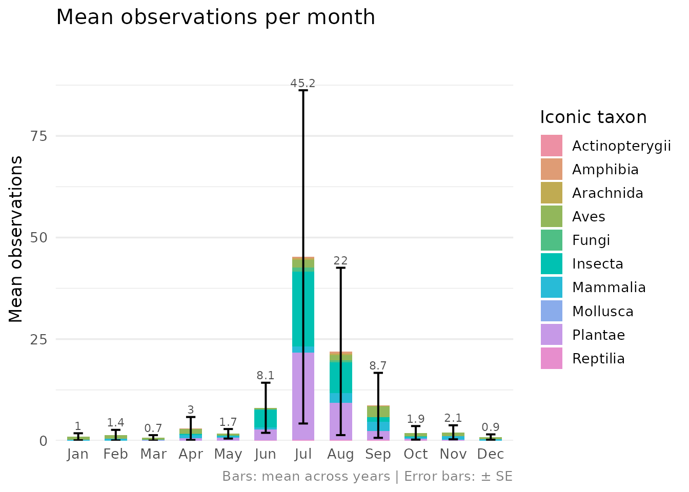
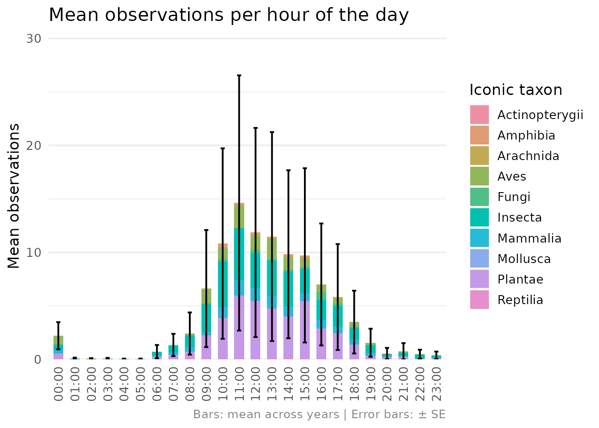
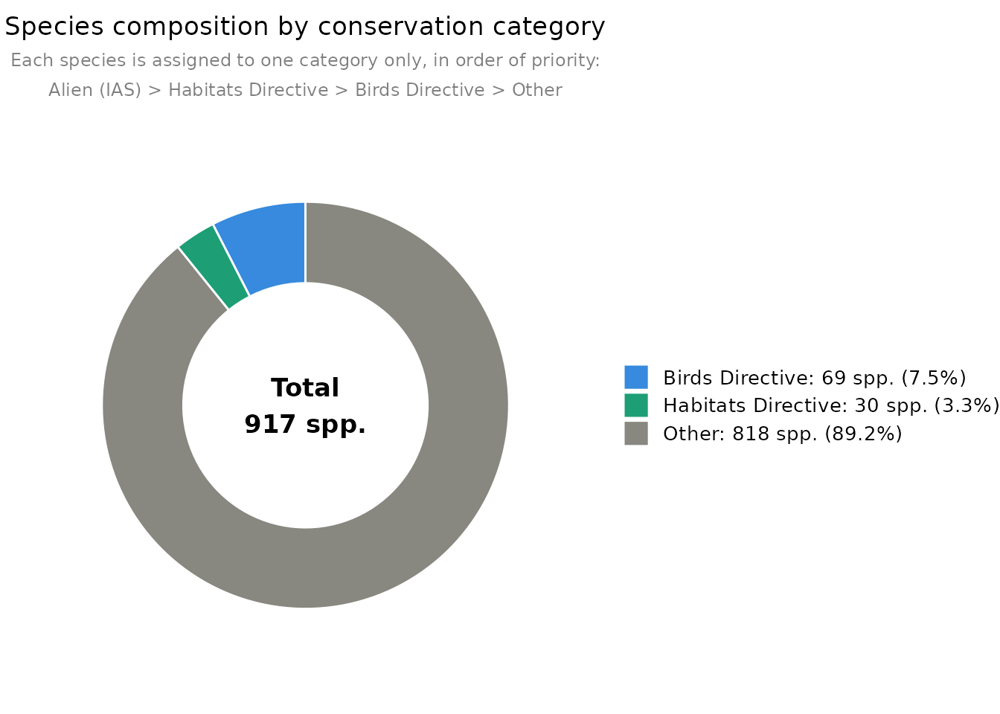
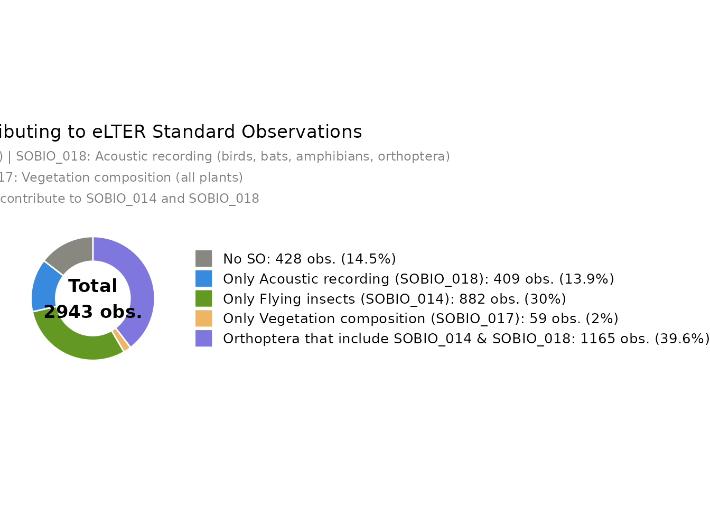

# Visualization functions

## Overview

This article illustrates the visualization functions available in
`ReLTER.inatEnrich` using occurrence data from the [Gran Paradiso
National Park](https://deims.org/15c3e841-8494-42d2-a44e-c49a0ff25946)
eLTER site — one of the long-term ecosystem research sites within the
eLTER-RI network. Functions cover taxonomic composition, conservation
status, temporal distribution, and the contribution of observations to
eLTER Standard Observations (SOs).

``` r

# Occurrence data from Gran Paradiso National Park eLTER site
# DEIMS-ID: https://deims.org/15c3e841-8494-42d2-a44e-c49a0ff25946
df <- ReLTER.inatEnrich::occ_eLTER_EUNIS
site_boundary <- ReLTER.inatEnrich::site_boundary
```

## Taxonomic composition

[`iconic_taxa()`](https://oggioniale.github.io/ReLTER.inatEnrich/reference/iconic_taxa.md)
shows the number of observations and species per iNaturalist iconic
taxon group.

``` r

iconic_taxa(df)
```



## Top observed species

[`top_n_species()`](https://oggioniale.github.io/ReLTER.inatEnrich/reference/top_n_species.md)
displays the most observed species coloured by iconic taxon group.

``` r

top_n_species(df, n = 10)
```



## Temporal distribution

### By year

``` r

obs_per_year(df)
```



### By month

``` r

obs_per_month(df)
```



### By hour of the day

``` r

obs_per_hour(df)
```



## Conservation category

[`obs_pie_chart()`](https://oggioniale.github.io/ReLTER.inatEnrich/reference/obs_pie_chart.md)
summarises species by conservation category following a fixed priority
order: Alien (IAS) \> Habitats Directive \> Birds Directive \> Other.

``` r

obs_pie_chart(df)
```



## eLTER RI Standard Observation

[`obs_SO_pie_chart()`](https://oggioniale.github.io/ReLTER.inatEnrich/reference/obs_SO_pie_chart.md)
shows how observations contribute to eLTER Standard Observations
SOBIO_014 (Flying insects) and SOBIO_018 (Acoustic recording — birds,
bats, amphibians and orthoptera). Orthoptera contribute to both SOs
simultaneously.

``` r

obs_SO_pie_chart(df)
```



## Interactive maps

[`species_richness_map()`](https://oggioniale.github.io/ReLTER.inatEnrich/reference/species_richness_map.md)
produces an interactive Leaflet map where each grid cell is coloured by
species richness.

``` r

species_richness_map(
  df = df,
  site_boundary = site_boundary,
  cell_size = 0.01
)
```

[`create_leaflet_occ_map()`](https://oggioniale.github.io/ReLTER.inatEnrich/reference/create_leaflet_occ_map.md)
shows each observation as a circle marker coloured by iconic taxon
group, with a detailed popup per observation.

``` r

create_leaflet_occ_map(
  occ_enriched = df,
  site_boundary = site_boundary
)
```
